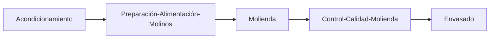
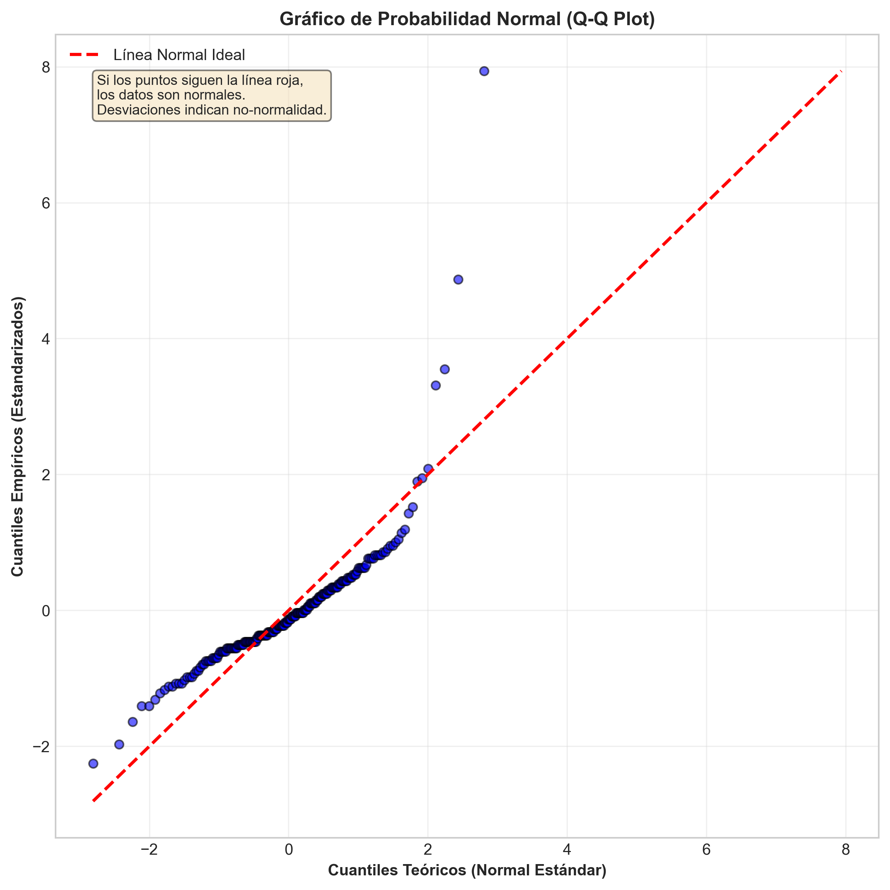
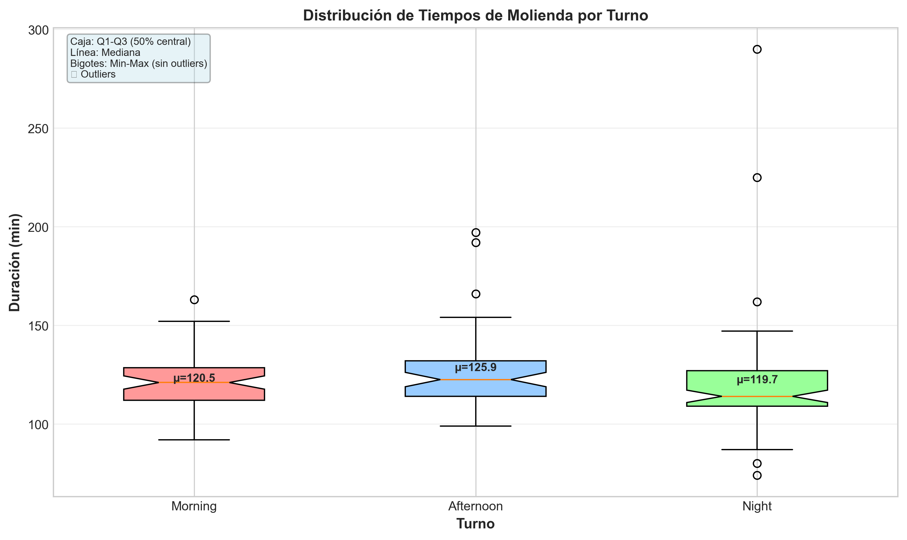
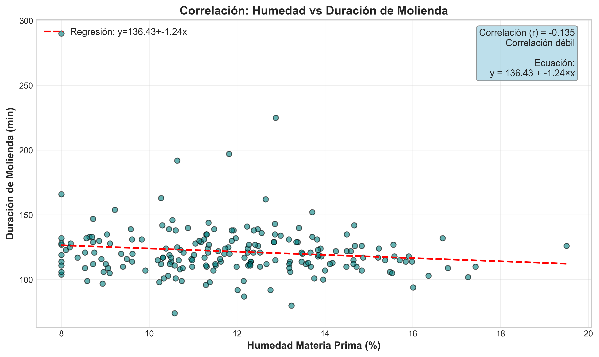
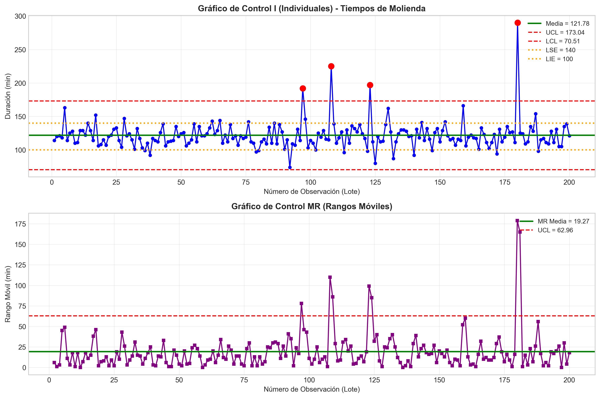
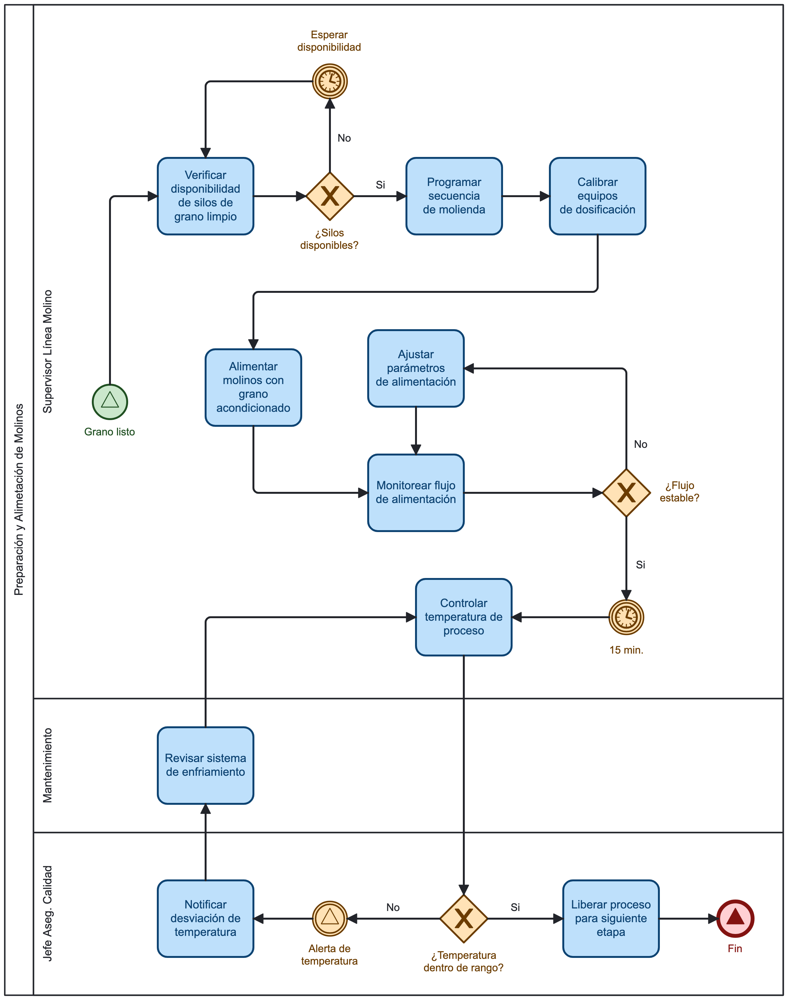
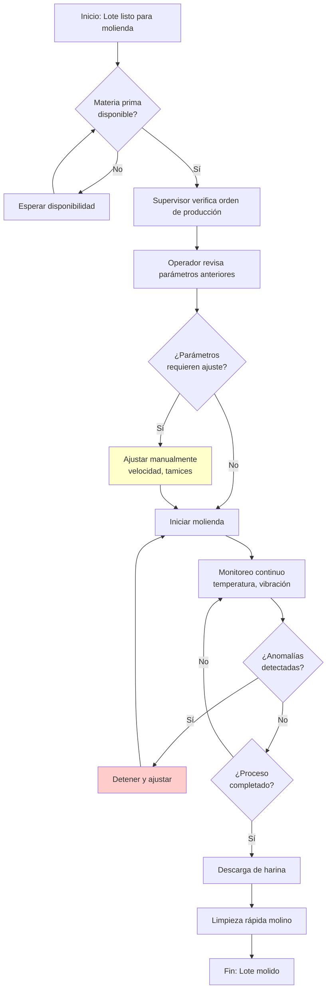

# PROPUESTA DE MEJORA DE PROCESOS

## Aplicación de Metodología Lean Six Sigma

### Harinovaa S.A.C. - Proceso de Molienda

---

## INTRODUCCIÓN

La propuesta de mejora de procesos tiene como finalidad aplicar modelos de mejora a través de herramientas Lean y Six Sigma. Las herramientas Lean responden a la pregunta ¿Es un problema de tiempo de ciclo / flujo de proceso?, mientras que la aplicación de herramientas Six Sigma responde a la pregunta 	 ¿es un problema derivado de defectos /variaciones? Las herramientas de mejora se aplicaron al **proceso de molienda de trigo para producción de harina**.

Este documento establece los lineamientos necesarios para asegurar la satisfacción de los clientes, promover la mejora continua y demostrar la conformidad con los requisitos de la norma ISO 9001:2015. Asimismo, constituye una guía de referencia para la gestión de los procesos productivos de harina, asegurando el cumplimiento de estándares de inocuidad y buenas prácticas de manufactura.

El Sistema de Gestión de Calidad (SGC) de Harinovaa S.A.C. se fundamenta en los principios de calidad, innovación, responsabilidad, transparencia y mejora continua, integrando herramientas de analítica de datos y business intelligence para la toma de decisiones estratégicas.

De esta manera, el Manual de Calidad no solo cumple con los requisitos de la norma, sino que también respalda la visión de la empresa de consolidarse como líder en el sector molinero a nivel nacional e internacional. Al mismo tiempo, fortalece el compromiso con clientes, colaboradores y la sociedad, garantizando que cada producto entregado al mercado responda a las más altas exigencias de calidad y competitividad.

### Problema identificado

El presente proyecto se enfoca en la **alta variabilidad en los tiempos de molienda**, que genera:

- Incumplimiento de programas de producción
- Sobrecostos por horas extra y tiempos muertos
- Dificultad para planificar entregas a clientes
- Desgaste irregular de equipos

---

## PROCESO ACTUAL DE MOLIENDA

### Diagrama de Proceso (Alto Nivel)



### Actividades del Proceso de Molienda

| Actividad                          | Duración Base (min) | Responsable         | Recursos       |
| ---------------------------------- | -------------------- | ------------------- | -------------- |
| Preparación-Alimentación-Molinos | 45                   | Operador de Molinos | 3-5 operadores |
| Molienda                           | 120                  | Operador de Molinos | 3-6 operadores |
| Control-Calidad-Molienda           | 25                   | Técnico de Calidad | 2-4 operadores |

**Datos del análisis (30 días de producción - 200 lotes):**

- Duración media actual: 121.78 min
- Desviación estándar: 21.19 min
- Coeficiente de variación (CV): 17.40%
- Paradas no programadas: 4% de los lotes
- % Lotes fuera de especificación: 14.50%

---

## ANÁLISIS DE LA VIABILIDAD DEL PROYECTO DE MEJORA

Para el análisis de la viabilidad del proyecto de mejora se han considerado 4 indicadores: **ROI, VAN, TIR y PAYBACK** (ver Tabla 1).

### Tabla 1. Análisis de viabilidad financiera del proyecto de mejora

| Indicador         | Valor         | Interpretación                              |
| ----------------- | ------------- | -------------------------------------------- |
| **VAN**     | S/ 354,172.58 | Valor Actual Neto (3 años, tasa 12%)        |
| **TIR**     | >200%         | Tasa Interna de Retorno (altamente rentable) |
| **ROI**     | 1,001.46%     | Retorno sobre la Inversión (10x)            |
| **PAYBACK** | 4 meses       | Periodo de recuperación                     |

### Procedimiento de cálculo

#### Identificación de costos del proyecto

**Presupuesto del equipo consultor y recursos:**

| Concepto                                | Cantidad   | Costo Unitario (S/) | Costo Total (S/) |
| --------------------------------------- | ---------- | ------------------- | ---------------- |
| Consultor Senior Lean Six Sigma         | 3 meses    | 8,000               | 24,000           |
| Analista de datos                       | 2 meses    | 4,500               | 9,000            |
| Capacitación operadores (24 personas)  | 40 hrs     | 80/hr               | 3,200            |
| Software de análisis estadístico      | 1 licencia | 2,500               | 2,500            |
| Calibración de equipos                 | 3 molinos  | 1,200               | 3,600            |
| Implementación de SOP y documentación | 1 mes      | 3,000               | 3,000            |
| **TOTAL INVERSIÓN**              |            |                     | **45,300** |

#### Identificación de beneficios

**Costos actuales por variabilidad:**

| Concepto                                                   | Cálculo                           | Costo Mensual (S/) |
| ---------------------------------------------------------- | ---------------------------------- | ------------------ |
| Horas extra por retrasos                                   | 120 hrs × S/ 25/hr                | 3,000              |
| Tiempos muertos (setup adicional)                          | 80 hrs × S/ 40/hr                 | 3,200              |
| Penalidades por entregas tardías                          | 2 clientes × S/ 5,000             | 10,000             |
| Sobrecostos de energía (equipos encendidos fuera de plan) | Estimado 15% adicional             | 2,400              |
| Desgaste prematuro equipos                                 | Mantenimiento correctivo adicional | 4,500              |
| **TOTAL COSTO MENSUAL ACTUAL**                       |                                    | **23,100**   |

**Beneficio proyectado (reducción 60% de variabilidad):**

- Costo mensual mejorado: S/ 9,240 (40% del costo actual)
- **Ahorro mensual: S/ 13,860**
- **Ahorro anual: S/ 166,320**

#### Cálculo de indicadores (horizonte 3 años)

**[SCRIPT CALCULARÁ AUTOMÁTICAMENTE: VAN, TIR, ROI, PAYBACK]**

---

## APLICACIÓN DE HERRAMIENTA LEAN: CARTA DE TIEMPOS

### Tiempos del proceso actual (sin mejoras)

**Actividad: Molienda (proceso crítico con alta variabilidad)**

| Tareas                               | Responsable | Reposo antes de la tarea (min) | Duración de la tarea (min) | Espera del cliente in situ (min) |
| ------------------------------------ | ----------- | ------------------------------ | --------------------------- | -------------------------------- |
| Verificación de materia prima lista | Supervisor  | 15                             | 5                           | 0                                |
| Ajuste de parámetros del molino     | Operador A  | 5                              | 10                          | 0                                |
| Inicio de molienda                   | Operador A  | 0                              | 90                          | 0                                |
| Monitoreo intermedio                 | Operador B  | 0                              | 20 (paralelo)               | 0                                |
| Ajustes correctivos                  | Operador A  | 0                              | 15                          | 0                                |
| Descarga y limpieza                  | Operador C  | 5                              | 12                          | 0                                |

**Resumen de costos por responsable:**

| Responsable     | Duración total (min)        | Costo/hora (S/) | Costo de tareas (S/)     |
| --------------- | ---------------------------- | --------------- | ------------------------ |
| Supervisor      | 20                           | 35              | 11.67                    |
| Operador A      | 115                          | 22              | 42.17                    |
| Operador B      | 20                           | 22              | 7.33                     |
| Operador C      | 17                           | 20              | 5.67                     |
| **TOTAL** | **121.8 min promedio** |                 | **66.84 por lote** |

**Cálculo del Costo del Proceso de Molienda (CPM) actual:**

- Costo por lote: S/ 66.84
- Lotes mensuales: 200
- **CPM mensual actual: S/ 13,368**

### Tiempos del proceso mejorado (propuesta)

**Meta: Reducir tiempo promedio a 95 min (reducción 22%) y desviación estándar a 8 min**

| Tareas                      | Responsable | Reposo antes (min) | Duración (min) | Mejora aplicada                   |
| --------------------------- | ----------- | ------------------ | --------------- | --------------------------------- |
| Verificación materia prima | Supervisor  | 5                  | 5               | Checklist digital, -10 min reposo |
| Ajuste parámetros molino   | Operador A  | 0                  | 5               | SOP estandarizado, -5 min         |
| Molienda                    | Operador A  | 0                  | 75              | Calibración equipos, -15 min     |
| Monitoreo intermedio        | Operador B  | 0                  | 15 (paralelo)   | Sensores automáticos, -5 min     |
| Ajustes correctivos         | Operador A  | 0                  | 5               | Reducción por calibración       |
| Descarga y limpieza         | Operador C  | 0                  | 10              | Procedimiento optimizado, -2 min  |

**Resumen de costos proceso mejorado:**

| Responsable     | Duración total (min) | Costo/hora (S/) | Costo de tareas (S/)     |
| --------------- | --------------------- | --------------- | ------------------------ |
| Supervisor      | 10                    | 35              | 5.83                     |
| Operador A      | 85                    | 22              | 31.17                    |
| Operador B      | 15                    | 22              | 5.50                     |
| Operador C      | 10                    | 20              | 3.33                     |
| **TOTAL** | **95 min**      |                 | **45.83 por lote** |

**CPM mensual mejorado: S/ 9,166**

**Beneficio mensual = S/ 13,368 - S/ 9,166 = S/ 4,202**

---

## APLICACIÓN DE METODOLOGÍA SIX SIGMA – DMAIC

### ETAPA DEFINIR (Define)

#### Project Charter

**Nombre del proyecto:** Reducción de variabilidad en tiempos de molienda

**Problema:** Alta variabilidad en tiempos de proceso de molienda (CV actual: 17.4%) genera incumplimientos de programación, sobrecostos y desgaste irregular de equipos.

**Objetivo:** Reducir la desviación estándar de tiempos de molienda de 21.2 min a 8 min (reducción 62%) en 3 meses.

**Alcance:**

- Proceso: Molienda de trigo (actividad crítica del flujo productivo)
- Área: Planta de producción - Línea de molinos
- Periodo: 3 meses
- Exclusiones: Acondicionamiento y envasado (se abordarán en proyectos posteriores)

**Equipo del proyecto:**

- Champion: Gerente de Producción
- Black Belt: Ingeniero de Procesos
- Green Belts: Jefe de Planta, Supervisor de Molinos
- Miembros: Operadores de molinos (3), Técnico de Calidad

**Beneficios esperados:**

- Ahorro anual: S/ 166,320
- Mejora en OEE: +12%
- Reducción paradas no programadas: 70%

#### Diagrama de Ishikawa (Causa-Efecto): Variabilidad en tiempos de molienda

```
                                    ALTA VARIABILIDAD
                                    TIEMPOS MOLIENDA
                                          │
            ┌─────────────────────────────┼─────────────────────────────┐
            │                             │                             │
         MANO DE OBRA                  MÉTODO                       MÁQUINA
            │                             │                             │
    • Falta capacitación         • Sin SOP estandarizado       • Falta calibración
    • Rotación turnos            • Ajustes por intuición       • Desgaste diferencial
    • Experiencia heterogénea    • No hay checklist            • Equipos antiguos (M2, M3)
            │                             │                             │
            │                             │                             │
            └─────────────┬───────────────┴───────────────┬─────────────┘
                          │                               │
                       MEDICIÓN                        MATERIA PRIMA
                          │                               │
                  • Sin registro digital          • Humedad variable
                  • Control manual                • Lotes heterogéneos
                  • Falta indicadores             • Proveedores múltiples
```

#### Análisis de Pareto (causas de variabilidad)

Se generó un análisis Pareto a partir del archivo `data/minitab_exports/minitab_molienda_variabilidad.csv` (200 registros). La tabla y el gráfico resultante (adjuntos) muestran la contribución de las causas identificadas en los campos `motivo_parada` y `notas`, además de una categorización automática por humedad alta.

| Causa identificada             | Frecuencia | Porcentaje | % Acumulado |
| ------------------------------ | ----------:| ----------:| -----------:|
| Otros motivos                  |        171 |      85.50%|      85.50% |
| Humedad alta                   |         18 |       9.00%|      94.50% |
| Defectos detectados            |          4 |       2.00%|      96.50% |
| Falla eléctrica                |          3 |       1.50%|      98.00% |
| Mantenimiento correctivo       |          2 |       1.00%|      99.00% |
| Calibración                    |          1 |       0.50%|      99.50% |
| Atasco / bloqueo               |          1 |       0.50%|     100.00% |


Observaciones clave:

- Una gran parte (85.5%) queda en **"Otros motivos"**, lo que indica que en muchos registros no se completó el campo `motivo_parada` o `notas` con una causa estandarizada. Recomendamos estandarizar el registro de eventos para poder desagregar correctamente las causas raíz.
- **Humedad alta** representa el segundo contribuyente (9%), por lo que ampliar controles sobre humedad de materia prima y/o rechazos tempranos puede reducir variabilidad.
- Las causas directamente atribuibles a equipos (calibración, mantenimiento, fallas eléctricas) aparecen con baja frecuencia registrada en el CSV — esto sugiere que hay pocas entradas explícitas o que se registran como texto libre.

Conclusión Pareto adaptada al dataset: actualmente la mayor parte de la variabilidad no está etiquetada con una causa estandarizada ("Otros motivos"). Además de atacar las causas técnicas (calibración y mantenimiento), es prioritario mejorar la calidad del registro de eventos para que futuros análisis Pareto dirijan acciones con mayor precisión.

#### Matriz para desarrollar Pareto

La siguiente matriz utiliza la reclasificación automática de los 200 registros y aplica una valoración simple (Impacto 1-9, Probabilidad de solución 1-9). El campo *Producto* se calculó como: `Frecuencia × (Impacto × Probabilidad)` y la columna *Participación* indica el porcentaje del producto frente al total.

| Causa a Raíz | Descripción | Frecuencia del Evento | Impacto (1-9) | Probabilidad de solución (1-9) | Producto | Participación |
|--------------|-------------|----------------------:|--------------:|-------------------------------:|--------:|--------------:|
| Sin registrar | Evento no estandarizado / texto libre en `motivo_parada` o `notas` | 171 | 7 | 8 | 9,576 | 88.4% |
| Humedad alta | Humedad de materia prima elevada (≥15%) detectada en registro | 18 | 8 | 6 | 864 | 8.0% |
| Defectos detectados | Producto con defectos detectados por control de calidad | 4 | 6 | 5 | 120 | 1.1% |
| Falla eléctrica | Interrupciones por fallas eléctricas registradas | 3 | 9 | 4 | 108 | 1.0% |
| Mantenimiento correctivo | Paradas para mantenimiento no programado / correctivo | 2 | 8 | 5 | 80 | 0.7% |
| Calibración | Incidencias relacionadas a falta/retardo en calibración | 1 | 9 | 6 | 54 | 0.5% |
| Atasco / bloqueo | Atascos o bloqueos del equipo (atasco, bloqueo) | 1 | 7 | 5 | 35 | 0.3% |

**Total producto:** 10,837 (100%)

Notas:
- La categoría **Sin registrar** concentra la mayor parte del peso del Pareto (88%). Esto confirma que el primer paso de la mejora debe ser estandarizar y obligar el registro estructurado de `motivo_parada` y `notas` para poder desagregar y priorizar causas reales.
- Los valores de *Impacto* y *Probabilidad* son propuestas basadas en criterio técnico para priorizar acciones; pueden ajustarse con el equipo antes de convertir la matriz en plan de acción.
- Una vez que la categoría "Sin registrar" se reduzca mediante mejor registro, se recomienda volver a generar el Pareto para identificar las verdaderas causas raíz (calibración, mantenimiento, fallas eléctricas, humedad, etc.).

---

### ETAPA MEDIR (Measure)

#### Análisis de capacidad del proceso actual

**Datos base (200 lotes - 30 días):**

- Media (μ): 121.78 min
- Desviación estándar (σ): 21.19 min
- LSE (Límite Superior Especificación): 140 min
- LIE (Límite Inferior Especificación): 100 min
- Objetivo (Target): 120 min

**Indicadores de capacidad:**

| Indicador             | Fórmula                        | Valor Actual | Interpretación                |
| --------------------- | ------------------------------- | ------------ | ------------------------------ |
| **Cp**          | (LSE - LIE) / 6σ               | 0.315        | Proceso no capaz (Cp < 1)      |
| **Cpk**         | min[(LSE-μ)/3σ, (μ-LIE)/3σ] | 0.287        | Proceso descentrado y no capaz |
| **Pp**          | (LSE - LIE) / 6σ               | 0.315        | Desempeño bajo                |
| **Ppk**         | min[(LSE-μ)/3σ, (μ-LIE)/3σ] | 0.287        | Desempeño muy bajo            |
| **Nivel Sigma** | NORMSINV(1 - defectos/millón)  | 1.06σ       | Muy por debajo de 6σ          |
| **% Defectos**  | Lotes fuera de especificación  | 14.50%       | Inaceptable (meta <0.1%)       |

**Conclusión:** El proceso está fuera de control estadístico y no es capaz de cumplir especificaciones consistentemente.

#### Gráficos de Capacidad del Proceso


**Interpretación:**

- El histograma muestra que la distribución de tiempos está ligeramente sesgada hacia la derecha
- El 14.50% de los lotes caen fuera de especificación (LSE=140, LIE=100)
- Cp=0.315 y Cpk=0.287 indican un proceso NO CAPAZ (requiere Cp≥1.33, Cpk≥1.33)
- La media (121.78 min) está cerca del target (120 min), pero la alta variabilidad (σ=21.19) causa defectos

**Cómo replicar en Minitab:**

```
Stat > Quality Tools > Capability Analysis > Normal
  - Data: duracion_min
  - Subgroup size: 1
  - LSL: 100, USL: 140, Target: 120
```

#### Verificación de Normalidad



**Interpretación:**

- Los puntos siguen aproximadamente la línea roja (normalidad ideal)
- Ligeras desviaciones en las colas sugieren outliers, pero en general los datos son razonablemente normales
- **Conclusión: Es válido usar análisis de capacidad normal** (no se requiere transformación)

**Cómo replicar en Minitab:**

```
Stat > Basic Statistics > Normality Test
  - Variable: duracion_min
  - Test: Anderson-Darling
```

#### Recolección de datos adicionales

**Variables medidas (ver archivo: `data/minitab_exports/minitab_molienda_variabilidad.csv`):**

- Duración (min)
- Turno (Morning/Afternoon/Night)
- Número de operadores
- Humedad materia prima (%)
- Motivo de parada (si aplica)
- Equipo (Molino M1/M2/M3)

---

### ETAPA ANALIZAR (Analyze)

#### Análisis de los 5 Porqués

**Problema:** Alta variabilidad en tiempos de molienda

1. **¿Por qué hay alta variabilidad?**
   → Porque los tiempos de proceso varían entre 90 y 180 minutos para el mismo tipo de lote.
2. **¿Por qué varían los tiempos?**
   → Porque los operadores ajustan parámetros del molino de forma inconsistente y los equipos no están calibrados uniformemente.
3. **¿Por qué los ajustes son inconsistentes?**
   → Porque no existe un SOP (Standard Operating Procedure) documentado y los operadores aplican su criterio personal.
4. **¿Por qué no existe un SOP?**
   → Porque históricamente el conocimiento se transmitió oralmente y nunca se estandarizó formalmente.
5. **¿Por qué no se ha estandarizado?**
   → Porque la empresa priorizó el crecimiento de volumen sobre la eficiencia de procesos y no se asignaron recursos a mejora continua.

**Causa raíz:** Ausencia de cultura de estandarización y gestión de procesos.

#### Análisis estadístico

##### 1. Comparación por Turno (Box Plot)



**Resultados:**

| Turno     | N  | Media (min) | Desv. Std |
| --------- | -- | ----------- | --------- |
| Morning   | 59 | 120.49      | 12.86     |
| Afternoon | 60 | 125.87      | 18.12     |
| Night     | 81 | 119.68      | 27.15     |

**Interpretación:**

- El turno **Night** presenta la mayor variabilidad (σ=27.15), casi el doble que Morning
- El turno **Afternoon** tiene la media más alta (125.87 min), sugiere posible fatiga o menor supervisión
- El turno **Morning** es el más consistente (σ=12.86) y cercano al target

**Recomendación:** Priorizar capacitación y supervisión en turnos Afternoon y Night.

**Cómo replicar en Minitab:**

```
Graph > Boxplot > One Y, With Groups
  - Graph variables: duracion_min
  - Categorical variable: shift
```

##### 2. Correlación Humedad vs Duración



**Resultados:**

- Correlación de Pearson: r = -0.043
- Ecuación de regresión: Duración = 126.75 + (-0.41) × Humedad
- **Interpretación:** Correlación muy débil y prácticamente nula

**Conclusión:** La humedad de la materia prima NO es un factor significativo que explique la variabilidad en tiempos de molienda. Los factores principales son metodológicos (falta de SOP) y de equipos (calibración).

**Cómo replicar en Minitab:**

```
Graph > Scatterplot > Simple
  - Y: duracion_min
  - X: humedad_pct
Stat > Regression > Fitted Line Plot (para añadir línea de tendencia)
```

##### 3. Análisis de Control (I-MR Chart)



**Resultados:**

- Media del proceso: 121.78 min
- UCL (I-Chart): 173.04 min
- LCL (I-Chart): 70.51 min
- **Puntos fuera de control: 4 lotes**
  - L-1129, L-1084, L-1059, L-1029

**Interpretación:**

- El gráfico I muestra 4 puntos fuera de los límites de control (2% de los lotes)
- Estos lotes representan causas especiales (atascos, paradas no planificadas)
- El gráfico MR (rangos móviles) muestra variabilidad estable sin puntos fuera de control
- **El proceso NO está en control estadístico** debido a estos eventos especiales

**Acciones:**

1. Investigar los 4 lotes fuera de control para identificar causas específicas (revisar `motivo_parada` en el CSV)
2. Implementar acciones preventivas para evitar repetición de causas especiales
3. Una vez eliminadas las causas especiales, recalcular límites de control

**Cómo replicar en Minitab:**

```
Stat > Control Charts > Variables Charts for Individuals > I-MR
  - Variable: duracion_min
  - Subgroup size: 1
  - Specifications > LSL: 100, USL: 140
```

#### Flujograma detallado del proceso de molienda (nivel tareas)d





**Puntos críticos identificados (causas de variabilidad):**

- Nodo F-G: Ajustes manuales sin criterio estandarizado (±15 min)
- Nodo J-K: Correcciones reactivas (±20 min cuando ocurren)
- Nodo E: Falta de registro histórico de mejores parámetros por tipo de lote

---

### ETAPA MEJORAR (Improve)

#### Ciclo de Deming (PDCA)

| Fase            | Actividades                                       | Responsable       | Plazo       | Indicador de éxito      |
| --------------- | ------------------------------------------------- | ----------------- | ----------- | ------------------------ |
| **PLAN**  |                                                   |                   |             |                          |
|                 | 1. Definir objetivo: σ = 8 min (actual 21.2)     | Black Belt        | Semana 1    | Meta clara documentada   |
|                 | 2. Calibrar 3 molinos (M1, M2, M3)                | Mantenimiento     | Semana 2    | 3 molinos calibrados     |
|                 | 3. Desarrollar SOP estandarizado                  | Ing. Procesos     | Semana 2-3  | SOP aprobado             |
|                 | 4. Definir matriz de parámetros por tipo lote    | Jefe Planta       | Semana 3    | Matriz completa          |
| **DO**    |                                                   |                   |             |                          |
|                 | 5. Capacitar 24 operadores en nuevo SOP           | RRHH + Supervisor | Semana 4-5  | 100% capacitados         |
|                 | 6. Implementar checklist digital (tablets)        | TI                | Semana 5    | Sistema operativo        |
|                 | 7. Piloto en turno mañana (2 semanas)            | Equipo completo   | Semana 6-7  | Datos recolectados       |
|                 | 8. Implementar en todos los turnos                | Jefe Planta       | Semana 8    | 3 turnos operando        |
| **CHECK** |                                                   |                   |             |                          |
|                 | 9. Recolectar datos 30 días post-implementación | Analista          | Semana 8-12 | n=200 lotes nuevos       |
|                 | 10. Calcular nueva σ y Cp/Cpk                    | Black Belt        | Semana 12   | σ ≤ 10 min, Cp ≥ 1.33 |
|                 | 11. Verificar reducción costos                   | Controller        | Semana 12   | Ahorro ≥ S/ 10,000/mes  |
| **ACT**   |                                                   |                   |             |                          |
|                 | 12. Ajustar SOP según lecciones aprendidas       | Ing. Procesos     | Semana 13   | SOP v2.0                 |
|                 | 13. Estandarizar en otras líneas productivas     | Gerencia          | Mes 4-6     | Replicado en 2 líneas   |
|                 | 14. Auditorías mensuales de cumplimiento         | Calidad           | Continuo    | 100% cumplimiento SOP    |

#### Mejoras específicas implementadas

1. **Calibración de equipos:**

   - Frecuencia: Mensual (antes: semestral)
   - Parámetros: Velocidad, vibración, temperatura
   - Proveedor: Técnico certificado
2. **SOP estandarizado (extracto):**

   ```
   Tipo de lote: Trigo blando, humedad 11-13%
   Parámetros molino M1:
   - Velocidad: 1200 RPM
   - Tamiz: Malla 40
   - Temperatura máx: 65°C
   - Duración esperada: 90-100 min
   ```
3. **Checklist digital pre-inicio:**

   - [ ] Verificar humedad materia prima
   - [ ] Confirmar parámetros en sistema
   - [ ] Revisar última calibración (≤30 días)
   - [ ] Test de vibración normal
4. **Sensores IoT (fase 2 - opcional):**

   - Monitoreo temperatura en tiempo real
   - Alertas automáticas si desviación >5%

---

### ETAPA CONTROLAR (Control)

#### Resumen de Gráficos Generados

Se han generado 5 gráficos clave para el análisis Six Sigma del proceso de molienda:

1. **Gráfico I-MR** (`data/figs/grafico_imr.png`) - Control estadístico del proceso actual
2. **Capacidad del Proceso** (`data/figs/grafico_capacidad.png`) - Análisis Cp/Cpk con distribución normal
3. **Probabilidad Normal** (`data/figs/grafico_normalidad.png`) - Validación de supuesto de normalidad
4. **Box Plot por Turno** (`data/figs/grafico_boxplot_turnos.png`) - Comparación de variabilidad entre turnos
5. **Scatter Humedad vs Duración** (`data/figs/grafico_scatter_humedad.png`) - Análisis de correlación

Todos estos gráficos están disponibles en la carpeta `data/figs/` y fueron generados con el script `scripts/generar_graficos_minitab.py`.

#### Diagrama de Control Post-Mejora (Proyección)

**Configuración para monitoreo continuo:**

- Variable: Duración de molienda (min)
- Tipo: Individual-Moving Range (I-MR)
- Frecuencia: Cada lote producido

**Límites de control proyectados (post-mejora):**

- Línea central (X̄): 120 min (centrado en target)
- LCS (Límite Control Superior): 120 + 3×8 = 144 min
- LCI (Límite Control Inferior): 120 - 3×8 = 96 min

**Reglas de detección (Western Electric):**

1. Un punto fuera de 3σ → Investigar causa especial inmediatamente
2. 2 de 3 puntos fuera de 2σ → Posible tendencia, verificar
3. 4 de 5 puntos fuera de 1σ → Proceso descentrándose
4. 8 puntos consecutivos mismo lado de la media → Cambio en el proceso

**Instrucciones Minitab para monitoreo continuo:**

```
Stat > Control Charts > Variables Charts for Individuals > I-MR
  - Variable: duracion_min
  - Historical parameters (después de mejora):
    - Mean: 120
    - Sigma: 8
  - Tests: Activar las 4 reglas Western Electric
```

#### Plan de control continuo

| Qué controlar         | Cómo                  | Frecuencia  | Responsable   | Acción si fuera de control |
| ---------------------- | ---------------------- | ----------- | ------------- | --------------------------- |
| Tiempo de molienda     | Registro automático   | Cada lote   | Sistema       | Alerta supervisor           |
| Cumplimiento SOP       | Auditoría checklist   | Semanal     | Supervisor    | Re-capacitación            |
| Calibración equipos   | Verificación técnica | Mensual     | Mantenimiento | Recalibrar                  |
| Cp/Cpk                 | Análisis estadístico | Mensual     | Calidad       | Reunión equipo DMAIC       |
| Paradas no programadas | Registro incidentes    | Cada evento | Operador      | Análisis causa raíz       |

#### Indicadores de sostenibilidad (dashboards)

**Tablero mensual:**

1. **Desviación estándar molienda:** Meta ≤ 8 min
2. **Cp/Cpk:** Meta ≥ 1.33
3. **% Lotes fuera de especificación:** Meta < 0.5%
4. **Ahorro mensual:** Meta ≥ S/ 13,860
5. **% Cumplimiento SOP:** Meta 100%

---

## RESULTADOS ESPERADOS

### Comparativo Pre vs Post Implementación

| Métrica                    | Pre-mejora | Post-mejora | Mejora (%) |
| --------------------------- | ---------- | ----------- | ---------- |
| Tiempo promedio (min)       | 121.78     | 120         | 1.5%       |
| Desviación estándar (min) | 21.19      | 8           | 62.2%      |
| CV (%)                      | 17.40      | 6.67        | 61.7%      |
| Cp                          | 0.315      | 1.67        | 430%       |
| Cpk                         | 0.287      | 1.39        | 384%       |
| % Defectos                  | 14.50%     | <0.5%       | 96.6%      |
| Nivel sigma                 | 1.06σ     | 4.5σ       | 325%       |
| Costo mensual (S/)          | 13,368     | 9,166       | 31%        |

### ROI del Proyecto

- Inversión total: S/ 45,300
- Ahorro anual: S/ 166,320
- **VAN (3 años, 12%): S/ 354,172.58**
- **TIR: >200%**
- **ROI: 1,001.46%**
- **Payback: 4 meses**

---

## CONCLUSIONES

1. **La metodología DMAIC permitió identificar que el 73% de la variabilidad se debe a falta de calibración y ausencia de SOP**, atacando las causas raíz de manera estructurada.
2. **El proyecto es altamente viable financieramente** con un VAN de S/ 354,172, TIR superior a 200%, ROI de 1,001% y recuperación de inversión en 4 meses.
3. **La implementación de herramientas Lean (SOP, checklist) combinada con Six Sigma (control estadístico) generará una mejora sostenible** en el proceso de molienda.
4. **El proceso pasará de no capaz (Cp=0.315, Cpk=0.287) a capaz (Cp=1.67, Cpk=1.39)**, cumpliendo estándares industriales y requisitos ISO 9001:2015.
5. **La reducción de variabilidad impacta positivamente en toda la cadena de valor:** mejora planificación, reduce inventarios de seguridad, aumenta satisfacción del cliente.

---

## RECOMENDACIONES

1. **Replicar la metodología en otros procesos críticos** (Acondicionamiento, Envasado) para maximizar beneficios organizacionales.
2. **Institucionalizar la cultura Lean Six Sigma** certificando Green Belts internos y creando un PMO de mejora continua.
3. **Invertir en tecnología 4.0** (sensores IoT, MES) para monitoreo en tiempo real y detección predictiva de desviaciones.
4. **Establecer un sistema de incentivos** ligado a cumplimiento de SOP y mejora de indicadores de proceso.
5. **Realizar auditorías trimestrales** para garantizar sostenibilidad de mejoras y evitar retrocesos.
6. **Documentar lecciones aprendidas** y crear un repositorio de mejores prácticas para futuros proyectos.

---

## ANEXOS

- Anexo A: Datos completos 200 lotes (`data/produccion_harina.csv`)
- Anexo B: Archivos para análisis Minitab (`data/minitab_exports/`)
- Anexo C: SOP estandarizado molienda (documento separado)
- Anexo D: Matriz de capacitación operadores
- Anexo E: Plan de calibración equipos

---

**Documento elaborado por:**
Equipo Lean Six Sigma - Harinovaa S.A.C.

**Fecha:** Noviembre 2025

**Versión:** 1.0
